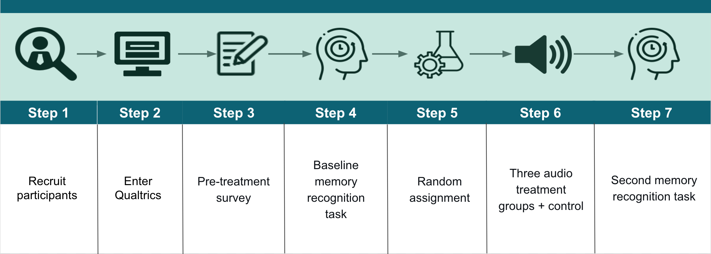
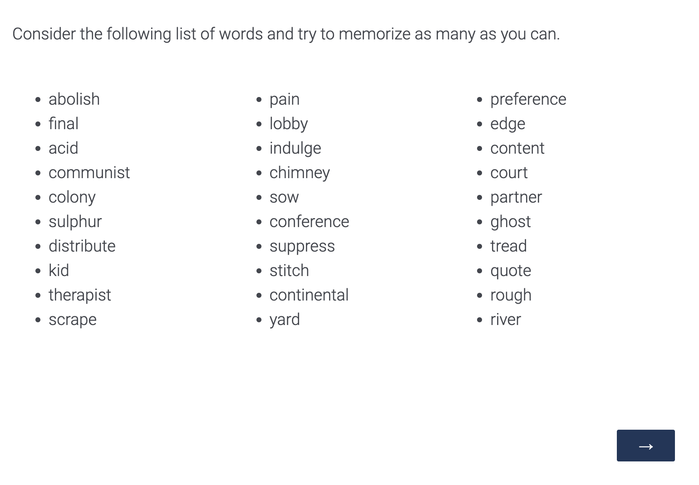
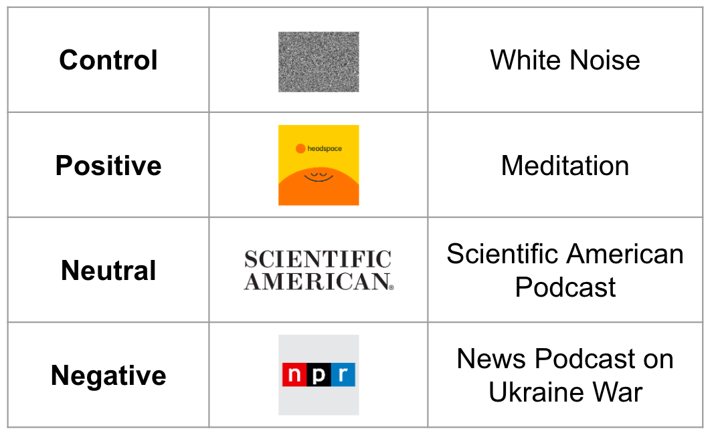
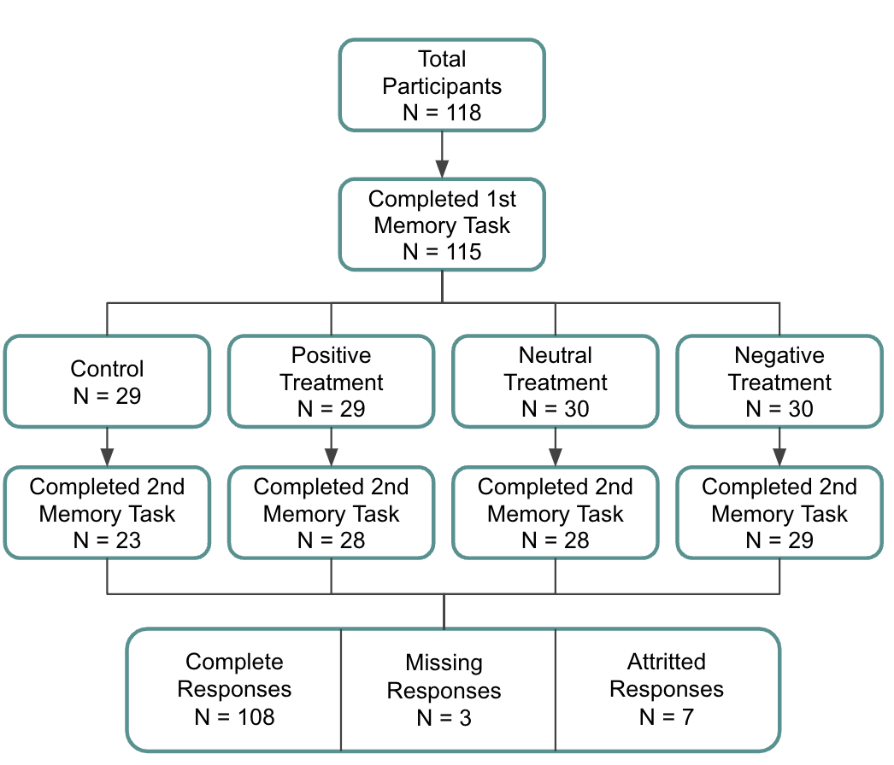

```{r package loads, warning=FALSE, message=FALSE, include=FALSE}
library(data.table)
library(sandwich)
library(lmtest)
library(ggplot2)
library(knitr)
library(patchwork)
library(stargazer)
library(vtable)
library(grid)
library(gridExtra)
library(tibble)
library(dplyr)
```

```{r knitr options, include=F}
knitr::opts_chunk$set(dpi=300, tidy.opts=list(width.cutoff=40), tidy=T, echo=F)
```


```{r data clean up, include = FALSE}
load('../data/processed/survey_data_clean_20220410.RData')
d <- data.table(x)

# Remove the ones that have no Q12 data (missing data)
d <- d[q12.score != 0,]

# TODO: check this (attrition?). Limit the results to answers that have something for Q25
d[q25.score == 0, ]
d[is.na(posttask.time),]
# These two above are *not* the same, I'm gonna keep the ones that are finished (2/7). The other 5/7 have no time spent in Q25 so we're good removing those.
d <- d[!is.na(posttask.time),]
```

```{r models}

```


```{r}

```


\tableofcontents
\newpage

# Introduction

In this paper, we explore the impact of four audio stimuli of varying emotional effect on cognitive function. More specifically, does negative audio stimuli impair cognitive performance compared to positive and neutral ones? Using a difference-in-differences (`DID`) experiment design in Qualtrics, participants completed a baseline memorization task, then they were randomly assigned to a treatment group and asked to complete a second memorization task. 

We found that there was no statistically significant effect of negative stimuli on cognitive function. We acknowledge as well that the negative stimuli used in this experiment may not have been strong enough to create a treatment effect and that the treatment may have needed to be repeated over time to detect a significant effect. 

## Prior Research

Previous studies have tested the impact of audio content with varying results. For example, when we explore meditation as a positive treatment and its effects on cognition, results have demonstrated reductions in mind-wandering, leading to improvements in GRE reading comprehension scores ^[https://pubmed.ncbi.nlm.nih.gov/23538911/]. In other studies, researchers found that it had also been connected to increases in left hippocampal volume in the brain as well as working and recognition memory performance ^[https://www.sciencedirect.com/science/article/abs/pii/S016643281830322X]. However, many of these experiments were conducted over multiple week periods, not as a single exposure study.

While there is stronger evidence of positive effects on cognitive performance for meditative content, the results are less conclusive for more negative content, such as shocking news–i.e. announcements related to wars, school shootings, pandemics, et cetera. A Finland study conducted a `DID` analysis to understand the impact of school shootings on a national high school examination and found that test scores dropped by 4.3 percentage points among males only ^[https://www.sciencedirect.com/science/article/pii/S0176268016301768]. That said, there are many stressors that a group of males can undergo over the year period between examinations, and it may be impractical to conclude that one traumatic event can have such a long-term effect on only one sex. 

In another study, researchers conducted an experiment around news exposure among older adults, which showed no effect on stress or cognitive function ^[https://journals.sagepub.com/doi/abs/10.1177/0091415017729684]. While there’s evidence of negative effects on cognitive functioning from direct trauma ^[https://link.springer.com/article/10.1186/1471-2377-10-61], such as the various forms of abuse, the indirect impact of alarming incidents is more unclear. 

Repeated exposure to negative content may be necessary to see a significant impairment on cognition, however this experiment seeks to measure the extent to which users underperform on memory tasks after a single exposure to negative stimuli compared to that of positive and neutral ones. Based on previous literature, we hypothesize that a negative stimulus will lead to worse cognitive performance while a positive stimulus will improve it. We also expect that our neutral stimulus should perform about the same as the control group.


## Recruitment

Our audio content experiment began and concluded in April 2022. Participants were recruited through word of mouth sharing with friends, family and other University of California, Berkeley students in addition to incentivized recruitment through Mechanical Turk. Because we recruited participants without respect to geographic location, we included a question in the first section of the survey to determine whether English is the participant's native language. This allowed us to include a covariate to account for any potential bias resulting from an unaccounted disadvantage, as the memorization task used English words.


\newpage

# Experimental Design

## Survey Design
We conducted the experiment using Qualtrics which allowed us to create a custom survey (Figure \@ref(fig:design)). The survey started with a pre-treatment question block asking for the participant's consent to data collection and demographic data, such as age range, gender, education, and English as a first language, as covariates to include in the analysis. If the user did not consent to participate, they immediately exited the experiment. Blocking was implemented by age range as we anticipated the results from older participants could create more variance given that memory can deteriorate with age. 


```{r design, echo=FALSE, fig.cap="Experimental Design Diagram", out.width = '75%', fig.align='center'}
# to adjust the caption, edit fig.cap above

```


Each participant was then prompted to complete a pre-treatment memory recognition task, where 30 words were shown for a period of one minute (Figure \@ref(fig:instructions)). Following exposure to this random list of words (sourced from random.org), participants were then given 30 seconds to select the words that they recognized from another list of 50 (Figure \@ref(fig:task)). The results from this task provided a baseline for cognitive performance. Within each block, participants were then randomly assigned to one of four groups–control, positive, neutral, and negative. After exposure to the treatment, participants were asked to complete another memory recognition task with a different set of 30 words. 


```{r instructions, echo=FALSE, fig.cap="Instructions in Survey", out.width = '75%', fig.align='center'}
# to adjust the caption, edit fig.cap above

```

```{r task, echo=FALSE, fig.cap="Memorization Task in Survey", out.width = '75%', fig.align='center'}
# to adjust the caption, edit fig.cap above

```

## Treatment Descriptions

All treatments contained an audio file, which was around five minutes in length. The control group received an audio of white noise and the positive treatment group listened to a meditation from Headspace. The neutral and negative treatment groups were each given a 5 minute podcast; one was on the science of finger snapping and the other was focused on the tragedies of the Ukraine War. See Figure \@ref(fig:treatments).


```{r treatments, echo=FALSE, fig.cap="Treatments and Control", out.width = '50%', fig.align='center'}
# to adjust the caption, edit fig.cap above

```

## Outcome Variables

Cognitive outcomes in this experiment were primarily measured by the number of words correctly recognized. While we also measured the length of time users took to complete this memory task, we did not expect many users to finish before the allotted 30 second time period.   

## ROXO methodology

Our experiment used a blocked difference-in-differences (DID) methodology, which can be illustrated with the following notation within each block:

```
R O Y O Y
R O Y X Y
R O Y X Y
R O Y X Y
```

The DID plots below illustrate the subtle differences across each treatment compared to control and its counterfactual. 

```{r}
#set up data for DID plots
dt <- tidyr::gather(d, observation, score, q12.score:q25.score)
dt$observation <- ifelse(dt$observation == 'q12.score', "post-treatment", "pre-treatment")
dt <- data.table(dt)
scores <- dt[, .(score = mean(score)), by = list(observation, treatment)] 

# Treatment group (Positive) before treatment
pos_pre <- scores[treatment == "positive" & observation == "pre-treatment", score]

# Treatment group (Positive) after treatment
pos_post <- scores[treatment == "positive" & observation == "post-treatment", score]

# Treatment group (Negative) before treatment
neg_pre <- scores[treatment == "negative" & observation == "pre-treatment", score]

# Treatment group (Negative) after treatment
neg_post <- scores[treatment == "negative" & observation == "post-treatment", score]

# Treatment group (Negative) before treatment
neutral_pre <- scores[treatment == "neutral" & observation == "pre-treatment", score]

# Treatment group (Negative) after treatment
neutral_post <- scores[treatment == "neutral" & observation == "post-treatment", score]

# Control group (white noise) before treatment
ctrl_pre <- scores[treatment == "control" & observation == "pre-treatment", score]

# Control group (white) after treatment
ctrl_post <- scores[treatment == "control" & observation == "post-treatment", score]

# Calculate counterfactual outcome (positive)
pos_counterfactual <- tibble(
  observation = c("pre-treatment","post-treatment"), 
  treatment = c("positive (counterfactual)","positive (counterfactual)"),
  score = as.numeric(c(pos_pre, pos_pre-(ctrl_pre-ctrl_post))))

# Calculate counterfactual outcome (neutral)
neutral_counterfactual <- tibble(
  observation = c("pre-treatment","post-treatment"), 
  treatment = c("neutral (counterfactual)","neutral (counterfactual)"),
  score = as.numeric(c(neutral_pre, neutral_pre-(ctrl_pre-ctrl_post))))

# Calculate counterfactual outcome (negative)
neg_counterfactual <- tibble(
  observation = c("pre-treatment","post-treatment"), 
  treatment = c("negative (counterfactual)","negative (counterfactual)"),
  score = as.numeric(c(neg_pre, neg_pre-(ctrl_pre-ctrl_post))))

# Data points for treatment event
intervention_pos <- tibble(
    observation = c("intervention", "intervention", "intervention"),
    treatment = c("positive", "control", "positive (counterfactual)"), 
    score = c(13.805, 11.0175, 13.805)
  ) 

intervention_neutral <- tibble(
    observation = c("intervention", "intervention", "intervention"),
    treatment = c("neutral", "control", "neutral (counterfactual)"), 
    score = c(10.39, 11.0175, 10.38)
  ) 

intervention_negative <- tibble(
    observation = c("intervention", "intervention", "intervention"),
    treatment = c("negative", "control", "negative (counterfactual)"), 
    score = c(9.05, 11.0175, 9.051)
  ) 

#Combine data (pos)
scores_pos <- filter(scores, treatment == "positive" | treatment == "control")

did_plotdata_pos <- bind_rows(scores_pos, 
                          pos_counterfactual,
                          intervention_pos
                          )

#combine data (neutral)
scores_neutral <- filter(scores, treatment == "neutral" | treatment == "control")

did_plotdata_neutral <- bind_rows(scores_neutral, 
                          neutral_counterfactual,
                          intervention_neutral
                          )

#combine data (negative)
scores_negative <- filter(scores, treatment == "negative" | treatment == "control")

did_plotdata_negative <- bind_rows(scores_negative, 
                          neg_counterfactual,
                          intervention_negative
                          )
```

```{r}
#pos did plot

pos_did_plot <- did_plotdata_pos %>%
  mutate(label = if_else(observation == "post-treatment", as.character(treatment), NA_character_)) %>%
  ggplot(aes(x=observation,y=score, group=treatment)) +
  scale_x_discrete(limits = c("pre-treatment", "intervention", "post-treatment"))+
  geom_line(aes(color=treatment), size=1.2) +
  geom_vline(xintercept = "intervention", linetype="dotted", 
             color = "black", size=1.1) + 
  scale_color_brewer(palette = "Accent") +
  scale_y_continuous(limits = c(9, 16)) +
  labs(x="", y="score (mean)", subtitle = "Difference-in-Differences (DID) plot: Positive Treatment vs Control") +
  annotate(
    "text",
    x = "post-treatment",
    y = 13.5,
    label = "{DID}",
    angle = 90,
    size = 2
  )

#neutral did plot

neutral_did_plot <- did_plotdata_neutral %>%
  mutate(label = if_else(observation == "post-treatment", as.character(treatment), NA_character_)) %>%
  ggplot(aes(x=observation,y=score, group=treatment)) +
  scale_x_discrete(limits = c("pre-treatment", "intervention", "post-treatment"))+
  geom_line(aes(color=treatment), size=1.2) +
  geom_vline(xintercept = "intervention", linetype="dotted", 
             color = "black", size=1.1) + 
  scale_color_brewer(palette = "Accent") +
  scale_y_continuous(limits = c(9, 15)) +
  labs(x="", y="score (mean)", subtitle = "Difference-in-Differences (DID) plot: Neutral Treatment vs Control") +
  annotate(
    "text",
    x = "post-treatment",
    y = 10.5,
    label = "{DID",
    angle = 90,
    size = 2
  )

#neg did plot

neg_did_plot <-did_plotdata_negative %>%
  mutate(label = if_else(observation == "post-treatment", as.character(treatment), NA_character_)) %>%
  ggplot(aes(x=observation,y=score, group=treatment)) +
  scale_x_discrete(limits = c("pre-treatment", "intervention", "post-treatment"))+
  geom_line(aes(color=treatment), size=1.2) +
  geom_vline(xintercept = "intervention", linetype="dotted", 
             color = "black", size=1.1) + 
  scale_color_brewer(palette = "Accent") +
  scale_y_continuous(limits = c(7, 13)) +
  labs(x="", y="score (mean)", subtitle = "Difference-in-Differences (DID) plot: Negative Treatment vs Control") +
  annotate(
    "text",
    x = "post-treatment",
    y = 10,
    label = "{DID}",
    angle = 90,
    size = 2
  )

pos_did_plot / neutral_did_plot / neg_did_plot
```

## Covariates
Most of our survey participants fell within the age groups of 18-30 and 30-40. Between our covariates, highest education was the covariate with the most variance across all participants. We then investigated the covariate balance across treatment groups in the age group blocks for education level.
```{r}
#count of respondents
respondent_cnt <- setorder(d[ , count := .N, by = .(age =age.demographic, treatment)])
respondent_cnt 

#plot grouped bar charts

ggplot(respondent_cnt, aes(fill=treatment, y=count, x=age.demographic, color=treatment)) + 
    labs ( title = "Respondent Count by Age Group and Treatment",
             x = "age group")+ 
    geom_bar(position="dodge", alpha = 0.6, stat="identity")  
   
```
```{r, echo = FALSE, fig.cap = "Age Group Distributions By Covariates"}
p1 <- ggplot(d, aes(x=gender, fill = age.demographic)) +
  geom_bar(position="stack", show.legend = FALSE) + ggtitle("Gender") + theme(plot.title = element_text(size=10))
p1 <- p1 + theme(axis.text.x = element_text(angle = 25, hjust = 1))
p2 <- ggplot(d, aes(x=highest.education, fill = age.demographic)) +
  geom_bar(position="stack", show.legend = FALSE) + labs (x = "highest education")  + ggtitle("Highest Education") + theme(plot.title = element_text(size=10))
p2 <- p2 + theme(axis.text.x = element_text(angle = 30, hjust = 1))
p3 <- ggplot(d, aes(x=english.native, fill = age.demographic)) +
  geom_bar(position="stack") + labs (x = "english native", fill = "age group") + ggtitle("English Native") + theme(plot.title = element_text(size=10))

p1 + p2 + p3 +    # Create grid of plots with title
  plot_annotation(title = "Age Group Distributions by Covariates") & 
  theme(plot.title = element_text(hjust = 0.5))

```


```{r, echo = FALSE, fig.cap ="Plots of Highest Education Distribution by Treatment and Age Group"}

p_distribution_all <- ggplot(d, aes(x=treatment, fill=highest.education)) + geom_bar(position="stack") + ggtitle("Highest Education by Treatment and Age Group") +theme(plot.title = element_text(size=10)) + theme(axis.text.x = element_text(angle = 25, hjust = 1)) + theme(legend.key.size = unit(0.2, "cm")) + labs(fill="Highest Education")

p_distribution_all + facet_grid(rows = vars(age.demographic), scales = "free_y")
```
The plot above shows that across treatment and control groups with ample sample size, education is evenly distributed within our experiment.

\newpage
# Power Analysis

```{r, echo=FALSE}
power.t.test(n= NULL, delta = 1, sd = 1, sig.level = 0.05, power = 0.8, type = "two.sample", alternative = "one.sided")
```


Prior to the experiment, we estimated a DID effect of 1 additional word correctly or incorrectly guessed between treatment and control with a standard deviation of 1, aiming for a power of 0.8. This would require at least 14 subjects in each treatment and control group to achieve.

# Data Analysis

## Attrition

In this experiment, attrition was defined as any individual who completed the first memory recognition task, but not the second one.

```{r truth table, echo=FALSE, fig.cap="Data Definitions for Completion and Attrition",  fig.env='table'}

dt <- data.frame( n = c("Missing Data", "Missing Data", "Attrition","Complete Data"),
                  r = c("No", "No", "Yes","Yes"),
                  c = c("No", "Yes","No", "Yes")
)

colnames(dt) <- c("Data Definitions","Completed First Memory Task","Completed Second Memory Task")

knitr::kable(dt)
# why isn't the fig caption showing up??
```

```{r, echo=FALSE, fig.cap = "Plot of Attrition by Age and Treatment"}
#Creating a status column in the original data set based on the previous truth table
d[, status := ifelse((q12.score != 0 & q25.score == 0 & finished == 0) | (finished == 1 & q12.score != 0 & q25.score == 0), "attritted", ifelse((q12.score == 0 & q25.score == 0) | (q12.score == 0 & q25.score != 0), "missing_data", "complete"))]

#Showing attrition visually
p_attrition1 <- ggplot(d, aes(x=age.demographic, fill = status)) +
  geom_bar(position="dodge") + labs(x = "age group")
p_attrition2 <- ggplot(d, aes(x= treatment, fill = status)) +
  geom_bar(position="dodge")
grid.arrange(p_attrition1, p_attrition2, top = "Attrition by Age and Treatment Group")

```

Majority of participants completed the experiment fully, while there were several attritted participants in all treatment and control groups.

```{r, echo = FALSE, fig.cap = "Attrition P-Value Table", warning=F}
#Creating subsets
#Simple subset by treatment
data_att_simple = d[, .N, by='treatment']
#Subset by treatment AND complete/attrition/missing data status
data_att <- d[, .N, by=c('treatment', 'status')]
setorder(data_att, cols = 'treatment')
#data_att
#Even more subsetting including our age group blocking
data_att_age <- d[, .N, by=c('age.demographic','treatment', 'status')]
setorder(data_att_age, cols = 'age.demographic')
#data_att_age
#Including attrition/missing data, equally distributed!
res <- data_att_simple[, chisq.test(N, p=c(1/4,1/4,1/4,1/4))]
#res
#Taking into account attrition for entire experiment
res2 <- data_att[status == 'complete', chisq.test(N, p=c(1/4,1/4,1/4,1/4))]
#res2
#Now by age group!
#18-30
res3 <- data_att_age[status == 'complete' & age.demographic == '18-30' , chisq.test(N, p=c(1/4,1/4,1/4,1/4))]
#res3
#30-40
res4 <- data_att_age[status == 'complete' & age.demographic == '30-40' , chisq.test(N, p=c(1/4,1/4,1/4,1/4))]
#res4
#The rest give warning of "Chi-squared approximation may be incorrect"
#Makes sense since we have much less data in these age groups compared to younger than 40
#40-50
res5 <- data_att_age[status == 'complete' & age.demographic == '40-50' , chisq.test(N, p=c(1/4,1/4,1/4,1/4))]
#res5
#50-60
res6 <- data_att_age[status == 'complete' & age.demographic == '50-60' , chisq.test(N, p=c(1/4,1/4,1/4,1/4))]
#res6
#60+
res7 <- data_att_age[status == 'complete' & age.demographic == '60+' , chisq.test(N, p=c(1/4,1/4,1/4,1/4))]
#res7
#Creating attrition table of p values
data_att_p <- data.table(
  age.demographic = c('18-30','30-40', '40-50', '50-60', '60+'),
  p.value = c(res3$p.value,res4$p.value,res5$p.value,res6$p.value,res7$p.value)
)
data_att_p
```

We can see that in all treatment groups and the control group, even with the attritted participants removed, there is an even distribution of participants within the age group blocks.


```{r flowchart, echo=FALSE, fig.cap="Participant Random Assignment Flow Chart", out.width = '50%', fig.align='center'}
# to adjust the caption, edit above

```

\newpage
# Analysis


For the data we have collected, we want to fit the following models on each of the outcome variables:

==TODO: swap out b4 and b5 ==

$$
\begin{aligned}
      \text{Completion time} &= \beta_0 + \beta_1 time + \beta_2 intervention + \beta_3 time*intervention + \epsilon \\
      \text{Score} &= \beta_0 + \beta_1 time + \beta_2 intervention + \beta_3 time*intervention  + \epsilon \\
      \text{Completion time} &= \beta_0 + \beta_1 time + \beta_2 intervention + \beta_3 time*intervention + \beta_4 \text{english native language} + \beta_5 \text{highest education} + \epsilon \\
      \text{Score} &= \beta_0 + \beta_1 time + \beta_2 intervention + \beta_3 time*intervention +  \beta_4 \text{english native language} + \beta_5 \text{highest education degree} + \epsilon \\
\end{aligned}
$$

Where we have added the **english as  native language** and **highest education degree** covariates to the longer models.

# Results

```{r Prepare the data (gather it)}
dd <- tidyr::gather(d, time, score, q12.score:q25.score)
dd$time <- ifelse(dd$time == 'q12.score', 0, 1)
dd <- data.table(dd)
```


## Score outcome models 

### Short model

```{r 1.1 Positive vs Control, results='asis'}
# 1.1 Positive vs Control
dd[, any_treatment := ifelse(treatment != 'control', 1, 0)]
m1.0 <- dd[, lm(score ~ time*any_treatment)]
m1.0$rse <- sqrt(diag(vcovHC(m1.0)))
m1.1 <- dd[treatment %in% c('control', 'positive'), lm(score ~ time*treatment)]
m1.1$rse <- sqrt(diag(vcovHC(m1.1)))
m1.2 <- dd[treatment %in% c('control', 'negative'), lm(score ~ time*treatment)]
m1.2$rse <- sqrt(diag(vcovHC(m1.2)))
m1.3 <- dd[treatment %in% c('control', 'neutral'),  lm(score ~ time*treatment)]
m1.3$rse <- sqrt(diag(vcovHC(m1.3)))
stargazer(m1.0, m1.1, m1.2, m1.3, type='latex',
		  dep.var.labels = 'Score (correct words remembered)',
		  column.labels = c('Any treatment', 'Positive', 'Negative', 'Neutral'),
		  title="Table 1. Score (correct words remembered) DID estimation",
		  se=list(m1.0$rse, m1.1$rse, m1.2$rse, m1.3$rse),
		  omit="^(any_treatment|time|treatmentpositive|treatmentnegative|treatmentneutral)$",
		  covariate.labels=c(
		  	'Any treatment',
		  	'DID estimator (positive)',
		  	'DID estimator (negative)',
		  	'DID estimator (neutral)'
		  ),
		  header=F
		  )
```
We have also fitted a model to compare people who were assigned _any treatment_ (i.e. an audio clip vs. the control which was white noise).

### Covariated model


```{r, results='asis'}
m3.1 <- dd[treatment %in% c('control', 'positive'), lm(score ~ time*treatment + highest.education + english.native)]
m3.1$rse <- sqrt(diag(vcovHC(m3.1)))
m3.2 <- dd[treatment %in% c('control', 'negative'), lm(score ~ time*treatment + highest.education + english.native)]
m3.2$rse <- sqrt(diag(vcovHC(m3.2)))
m3.3 <- dd[treatment %in% c('control', 'neutral'),  lm(score ~ time*treatment + highest.education + english.native)]
m3.3$rse <- sqrt(diag(vcovHC(m3.3)))
stargazer(m3.1, m3.2, m3.3, type='latex',
		  dep.var.labels = 'Score (correct words remembered)',
		  column.labels = c('Positive', 'Negative', 'Neutral'),
		  title="Table 2. Score (correct words remembered) DID estimation (covariated model)",
		  se=list(m3.1$rse, m3.2$rse, m3.3$rse),
		  omit="^(time|treatmentpositive|treatmentnegative|treatmentneutral)$|Other",
		  covariate.labels=c(
		  	'Bachelor\'s degree',
		  	'High school diploma',
		  	'Master\'s Degree',
		  	'PhD/MD/JD',
		  	'English as native language',
		  	'DID estimator (positive)',
		  	'DID estimator (negative)',
		  	'DID estimator (neutral)'
		  ),
		  header=F
		  )
```


As we can see from the model results, none of the difference-in-differences estimators produced a statistically significant effect. 
In practical terms, this suggests that the treatment of the audio clips did not have any effect on the recall ability of the participants. It's interesting to note that we can't see an effect on either the individual treatments (negative, positive, neutral), nor the application of any treatment. 

Though the underlying literature suggests that there should be an effect from the meditation one, according to ==INSERT REFERNCE HERE==, our analysis of the 5-minute intervention does not support this data. We do not make a statement either refuting or supporting the previous literature, however. In this case, given the relatively short duration of the treatment, we are probably unable to detect a treatment with the given dosage. Further replications of the experiment with longer doses of the treatments are recommended to be able to definitively assert one or another conclusion.


## Completion time outcome

```{r}
ddx <- tidyr::gather(d, time, completion.time, pretask.time:posttask.time)
ddx$time <- ifelse(ddx$time == 'pretask.time', 0, 1)
ddx <- data.table(ddx)
```


### Short time model

```{r Short time model, results='asis'}
m50.1 <- ddx[treatment %in% c('control', 'positive'), lm(completion.time ~ time*treatment)]
m50.1$rse <- sqrt(diag(vcovHC(m50.1)))
m50.2 <- ddx[treatment %in% c('control', 'negative'), lm(completion.time ~ time*treatment)]
m50.2$rse <- sqrt(diag(vcovHC(m50.2)))
m50.3 <- ddx[treatment %in% c('control', 'neutral'),  lm(completion.time ~ time*treatment)]
m50.3$rse <- sqrt(diag(vcovHC(m50.3)))
stargazer(m50.1, m50.2, m50.3,
		  type='latex',
		  dep.var.labels = 'Completion time (secs)',
		  column.labels = c('Positive', 'Negative', 'Neutral'),
		  title="Table 3. Completion time covariated model",
		  se=list(m50.1$rse, m50.2$rse, m50.3$rse),
		  omit="^(time|treatmentpositive|treatmentnegative|treatmentneutral)$",
		  covariate.labels=c(
		  	'DID estimator (positive)',
		  	'DID estimator (negative)',
		  	'DID estimator (neutral)'
		  ),
		  header=F
  )
```

Similarly for the time model, we can see there is no significant effect on the completion time. In fact, taking a look at the completion time distribution for our survey participants, we find that most participants (X % ADD PERCENTAGE HERE) utilized the full 30 seconds allotted to the time completion.

```{r}
dd[, hist( posttask.time)]
```


- Talk about why the time limit was probably a design flaw in the experiment


### Covariated time model


```{r Long time model, results='asis'}
m53.1 <- ddx[treatment %in% c('control', 'positive'), lm(completion.time ~ time*treatment + highest.education + english.native)]
m53.1$rse <- sqrt(diag(vcovHC(m53.1)))
m53.2 <- ddx[treatment %in% c('control', 'negative'), lm(completion.time ~ time*treatment + highest.education + english.native)]
m53.2$rse <- sqrt(diag(vcovHC(m53.2)))
m53.3 <- ddx[treatment %in% c('control', 'neutral'),  lm(completion.time ~ time*treatment + highest.education + english.native)]
m53.3$rse <- sqrt(diag(vcovHC(m53.3)))
stargazer(m53.1, m53.2, m53.3,
		  type='latex',
		  se=list(m53.1$rse, m53.2$rse, m53.3$rse),
		  dep.var.labels = 'Completion time (secs)',
		  column.labels = c('Positive', 'Negative', 'Neutral'),
			title="Table 4. Completion time covariated model",
		  omit="^(time|treatmentpositive|treatmentnegative|treatmentneutral)$|Other",
		  covariate.labels=c(
		  	'Bachelor\'s degree',
		  	'High school diploma',
		  	'Master\'s Degree',
		  	'PhD/MD/JD',
		  	'English as native language',
		  	'DID estimator (positive)',
		  	'DID estimator (negative)',
		  	'DID estimator (neutral)'
		  ),
			header=F
		  )

```

Adding each of the 

==UNDERPOWERDNESS==

## Limitations


Since we did not actively monitor users as they participate in this experiment we cannot be confident that every respondent engaged with the stimulus in the same manner. For example, participants may have multitasked during the audio treatment or they may have taken screenshots of the word list to memorize. 

Additionally, the different treatments may have been more engaging than others. ==TODO: revise== For example, it may be harder for a participant to focus on a white noise control for a five minute duration, causing more users in this group to attrit. 

We also acknowledge participants could have "gamed" the experiment by selecting every single word in the recall list. The survey did not tell the participant if their selection was correct or not, which we intended to disincentivize this behavior. Our scoring methodology did not penalize incorrect answers, so this could have had unintended consequences in our analysis. However, when we reviewed the data and included a penalty for incorrect answers, there were very few instances where the penalized score differed from the simple count score. 

In our survey design we also made one mistake, creating overlapping age groups (e.g. 30-40 and 40-50). ==TODO: revise== So for participants aged 40 may have been confused and declined to participate, or chose one age group inconsistently (i.e. some 40 year olds chose the younger group and others chose the older). 

Finally, the amount of time that we allotted to participants to complete the memory recognition task was likely problematic for our models where the task completion time was the outcome variable. Some participants reported that thirty seconds wasn't a sufficient amount of time to complete the task, and if the majority of participants felt this way, then this could have minimized a treatment effect within our results. Extending the task completion time in a future iteration would remove this limitation. 

\newpage
# Conclusion

\newpage
# References

@article{R-base,
  title = {Mindfulness training improves working memory capacity and GRE performance while reducing mind wandering},
  author = {{Michael D Mrazek, Michael S Franklin, Dawa Tarchin Phillips, Benjamin Baird, Jonathan W Schooler}},
  organization = {Department of Psychological and Brain Sciences},
  address = {University of California, Santa Barbara, CA 93106, USA.},
  year = {2013},
  url = {https://pubmed.ncbi.nlm.nih.gov/23538911/},
}

@article{BASSO2019208,
title = {Brief, daily meditation enhances attention, memory, mood, and emotional regulation in non-experienced meditators},
journal = {Behavioural Brain Research},
volume = {356},
pages = {208-220},
year = {2019},
issn = {0166-4328},
doi = {https://doi.org/10.1016/j.bbr.2018.08.023},
url = {https://www.sciencedirect.com/science/article/pii/S016643281830322X},
author = {Julia C. Basso and Alexandra McHale and Victoria Ende and Douglas J. Oberlin and Wendy A. Suzuki}
}

@article{POUTVAARA201893,
title = {Shocking news and cognitive performance},
journal = {European Journal of Political Economy},
volume = {51},
pages = {93-106},
year = {2018},
issn = {0176-2680},
doi = {https://doi.org/10.1016/j.ejpoleco.2017.03.006},
url = {https://www.sciencedirect.com/science/article/pii/S0176268016301768},
author = {Panu Poutvaara and Olli Ropponen}
}

@article{doi:10.1177/0091415017729684,
author = {Caroline Deal and Ryan Bogdan and J. Phil Miller and Tom Rodebaugh and Charlene Caburnay and Mike Yingling and Tammy Hershey and Julia Schweiger and Eric J. Lenze},
title ={Effects of Cable News Watching on Older Adults’ Physiological and Self-Reported Stress and Cognitive Function},
journal = {The International Journal of Aging and Human Development},
volume = {87},
number = {2},
pages = {111-123},
year = {2018},
doi = {10.1177/0091415017729684},
    note ={PMID: 29139320},
URL = { 
        https://doi.org/10.1177/0091415017729684}
}

@article{R-base,
  title = {Association of childhood trauma with cognitive function in healthy adults: a pilot study},
  author = {{Majer, M., Nater, U.M., Lin, JM.S. et al.}},
  organization = {BMC Neurol 10},
  year = {2010},
  url = {https://doi.org/10.1186/1471-2377-10-61},
}